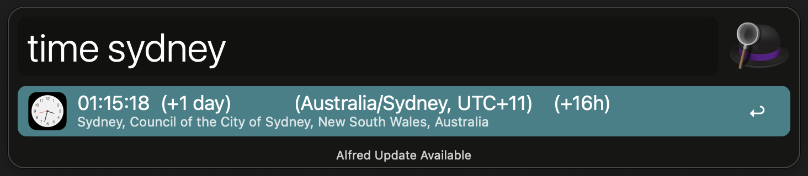

# alfred-time-anywhere

[Alfred](https://www.alfredapp.com/) workflow that will show you the time anywhere in the planet.


You can search for any country/city/village/address.

The information displayed is:
```
Time (days difference if any)   (Timezone, UTC offset)   (hours difference with local time)
Address
```



Run it with `time <your place>`. You can change the keyword by opening Alfred and double clicking on the workflow script.

You can install download the latest version in the [releases](https://github.com/juanborre/alfred-time-anywhere/releases) page.

## How it works

The script uses the Python [Geopy](https://pypi.org/project/geopy/) package in order to find the GPS coordinates of the place you type.

Then, it will do a query to the [ipgeolocation API](https://ipgeolocation.io/) in order to find the time and the timezone.

There are other approaches using other Python packages but either the workflow size was too big due to the dependencies or the response time was too long. This solution seems to find a sweetspot between the two.

## Configuration

The workflow works out of the box with a default `API_KEY` for the [ipgeolocation API](https://ipgeolocation.io/).

The API has a request limit so, if you stick with using the workflow, I suggest that you make your own to let space for other people and not to be rate limited yourself.

You can set your own `API_KEY` in the workflow configuration.

Making a developer `API_KEY` is free of charge as of today.

Enjoy! 👋